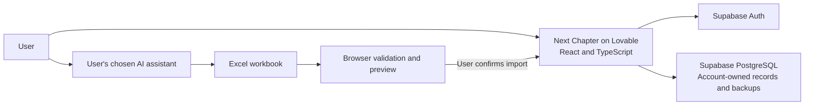

# Next Chapter

### Track your job search. Decide what to apply to next.

Next Chapter is a personal job-search workspace that brings researched roles, resume fit, personal priorities and application progress into one place. Import a workbook, compare opportunities, record your next steps and follow your progress as it happens.

**[Open Next Chapter](https://next-chapter-by-khiz.lovable.app/)** · **[Try the demo](https://next-chapter-by-khiz.lovable.app/?view=demo)** · **[Architecture](architecture.md)**

Built by [Khiz](https://github.com/Built-by-Khiz).

This repository contains the public product and architecture documentation. Use the links above to explore the live application and demo.

## Why I built it

A job search creates several kinds of information: facts about a role, an assessment of how well it fits, and the applicant's own decisions and follow-ups. Those details often end up scattered across spreadsheets, job-board tabs, research conversations and notes.

I built Next Chapter to keep that research useful after the first shortlist. The app preserves job information alongside a personal application record, so new research can update the role without overwriting the applicant's status, notes or dates.

## What you can do

| Capability | How it helps |
| --- | --- |
| Track applications | Keep companies, roles, links, locations, statuses, notes and follow-up dates together. |
| Compare two separate scores | See imported **Resume fit /100** and **Priority /100** scores and sort by either. |
| Search in familiar language | Combine text, field filters, dates and score comparisons, such as `resume fit above 80`. |
| Import a research workbook | Review an Excel file in your browser before confirming the import into your account. |
| Use your preferred AI tool | Copy the built-in research prompt or download the skill, generate a compatible workbook externally, then import it. |
| Follow your progress | See recorded application journeys in a Sankey chart on the workspace home screen, with exact counts in tables. |
| Recover an earlier workspace | Create backups, download or upload backup JSON, and preview a restore before confirming it. |
| Choose automatic backups | Save before changes or use interval, daily or weekly schedules. |
| Work through a long list | Browse compact cards, expand notes as needed and reveal another 50 matching roles as you scroll. |
| Try it before signing in | Explore fictional applications in a browser-only demo. |

The interface supports light and dark themes. Private workspaces support Google sign-in and email/password accounts.

## One example journey

1. Use your chosen AI assistant to research roles against your resume and agreed priorities.
2. Import the resulting workbook and review its rows before saving.
3. Sort by priority, then narrow the list with a query such as `resume fit above 80`.
4. Apply to a role and update its status from **Saved** to **Applied**.
5. Record later changes and follow the journey on the home-screen chart.

The scores come from the imported research. Resume fit measures alignment with the role; priority reflects the user's own preferences. Their meaning depends on the evidence and rubric used to create them.

## Architecture at a glance

| Layer | Technology or approach |
| --- | --- |
| Interface | React, TypeScript, Tailwind CSS, Radix UI and Lucide icons |
| Application framework | TanStack Start, TanStack Router, TanStack Query and Vite |
| Hosting | Lovable |
| Authentication and persistence | Supabase Auth and PostgreSQL |
| Data access | Account-scoped reads, row-level security and owner-checked database functions |
| Workbook processing | SheetJS in a browser Web Worker |
| Search and progress | Local query parsing, a custom SVG Sankey and accessible tables |
| Scheduled backups | PostgreSQL functions invoked by `pg_cron` |

See the [architecture document](architecture.md) for component responsibilities, data flows and boundaries.

## Design choices that matter

- **Job availability and application status are separate.** An open posting does not mean the user applied. Saved is the starting state for newly researched opportunities.
- **Research and personal tracking have separate records and update rules.** A research refresh preserves existing application statuses, notes and dates.
- **History reflects recorded activity.** Imported starting statuses do not invent earlier application stages.
- **Unknown stays unknown.** A missing score is not a zero, and an unverified posting is not presented as confirmed open.
- **Users control AI research.** The app supplies instructions and an import contract. The user chooses the assistant and what information to share with it.
- **Import and restore are reviewed actions.** Preview, confirmation and safety copies are part of the workflow.

## Project status

Next Chapter is published and in early user testing. Initial live checks covered sign-in, separate account workspaces, importing a fictional dataset with scores, and a backup download/upload/restore round trip.

Python validation tools and MLflow experiments are proposed next steps. They are documented in the [roadmap](roadmap.md) and are not part of the current application runtime.

## Documentation

| Document | What it covers |
| --- | --- |
| [Product brief](PRD.md) | Problem, intended users, user journeys and product decisions |
| [Architecture](architecture.md) | System diagram, components, data model and core flows |
| [Research and import workflow](import-and-ai-workflow.md) | External AI research, score meaning and workbook compatibility |
| [Roadmap](roadmap.md) | Current capabilities and proposed validation/evaluation work |

This is the public documentation repository for Next Chapter. The application runs on Lovable; its source code, deployment configuration and private workspace data are not included here.
