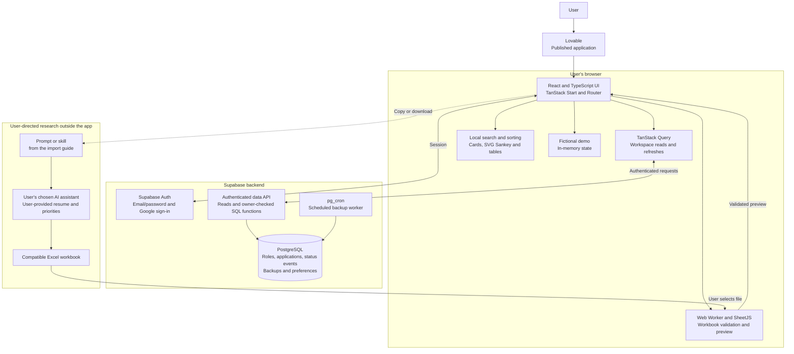

# Next Chapter architecture

Next Chapter uses a React and TypeScript interface hosted through Lovable, with Supabase Auth and PostgreSQL for private application data. The browser handles interaction, workbook preview, search and chart rendering. Database functions own transactional changes, imports, backups and restores.

This document describes the implemented application. It is a high-level overview, not a deployment bundle.

## System overview

The research assistant is an external step selected by the user. The application does not call an LLM to run search, calculate scores or process the resume.

## Component responsibilities

| Component | Responsibility |
| --- | --- |
| Application shell | Landing page, demo and account views; theme and navigation. |
| Authentication | Supabase email/password sessions and Google sign-in through the Lovable OAuth integration. |
| Workspace client | Load account-owned data, submit changes, refresh state and clear cached data when the account changes. |
| Workbook worker | Inspect the XLSX container, recognize supported schemas, validate values and return normalized preview data. |
| Import controller | Create a safety backup, submit batches and report confirmed progress or uncertain outcomes. |
| Search and list | Parse supported queries, filter and sort the loaded workspace, then reveal cards in groups of 50. |
| Progress model | Build chart paths and exact-count tables from recorded status observations. |
| Database functions | Coordinate saves, imports, backup operations, restore checks and scheduled copies. |
| Demo adapter | Keep fictional interactive data in browser memory, separate from the private workspace. |

## Data model

| Table | Purpose |
| --- | --- |
| `job_roles` | Researched company/role facts, posting availability, source identity and research details, including imported scores. |
| `applications` | The user's status, personal notes, applied date and follow-up date for a role. |
| `application_status_events` | Initial observations, baseline observations and subsequent status changes. |
| `application_backups` | Account-owned snapshots of roles, applications and recorded status history. |
| `application_backup_settings` | Automatic backup preference, schedule and retention settings. |

A user-owned role has at most one associated application. Owner relationships, row-level security and owner checks inside database functions enforce account boundaries. Deleting a role removes its associated application and status events. Restoring a snapshot returns those records to their saved state; automatic backup preferences remain separate.

## Main data flows

### Sign in and load a workspace

The browser establishes a Supabase session, verifies the signed-in user and loads that user's records. Private requests retain the expected account identity; switching accounts clears cached query data and interrupts operations associated with the old account.

### Save an application

The interface validates the fields and calls an authenticated save function. Role and application changes are saved together. Status tracking records a real change when the application stage changes. Configured before-change backup protection runs within the write transaction.

### Preview and import a workbook

1. The user selects an `.xlsx` file.
2. A browser worker validates and normalizes its contents. Preview does not upload the original workbook.
3. The user reviews the rows, import mode and destination account.
4. Confirmation creates a pre-import safety copy and starts sequential batches of at most 100 rows.
5. Database functions validate and persist each batch under the signed-in owner.

Stable source identities allow reimports to find existing records. The default skips them. Research refresh accepts eligible same-date or newer snapshots while preserving personal application statuses, notes and dates.

Each batch is transactional. The complete workbook is not one transaction: a later failure leaves earlier confirmed batches saved. An uncertain response is reported as uncertain because the server may already have committed it.

### Search, sort and render

Search uses local rules for terms, fields, score comparisons and dates. All conditions must match. Scores are read from imported research and missing scores remain unavailable.

The current tracker reads a bounded workspace of up to 5,000 applications. It filters and sorts that dataset before progressively revealing cards. Scrolling reveals more already-loaded results; it is not server-side cursor pagination.

### Show progress

An account-scoped database function provides a lean application/history snapshot. The browser turns recorded observations into an SVG Sankey and supporting tables.

Initial or imported statuses are starting observations. The chart does not reconstruct earlier stages. Ambiguous histories are marked incomplete, and long paths can fall back to a current-status view. Deleted applications do not remain in this current-workspace view.

### Back up and restore

Manual and automatic copies store roles, applications and status history. A downloaded JSON file can be uploaded back to the same account as a saved backup; upload alone does not replace the workspace.

Restore preview returns record counts and a workspace-state check. A confirmed restore verifies that state, saves a safety copy and replaces the workspace in a transaction. Per-account locking coordinates conflicting writes. The UI distinguishes a confirmed result from a request whose completion could not be confirmed.

### Run scheduled backups

`pg_cron` invokes the database backup worker periodically. It checks each account's stored preference and due time, creates eligible snapshots and applies automatic-copy retention. This happens independently of an open browser. Registration and recent completion are reported separately in the settings interface.

## Data handling and boundaries

- The public repository contains documentation. The live application and private workspace records are separate.
- Browser preview keeps workbook parsing local; confirmed import sends normalized records to the backend.
- Authentication plus database authorization protects private records. Hiding a field in the UI is not an access-control mechanism.
- Demo data remains in browser memory and does not write to the private database.
- Backup JSON includes personal tracking data. It is a portable snapshot, not an anonymized export.
- Structural workbook validation cannot establish that a listing is current or that a score is well justified.
- Search and scoring display have no runtime dependency on Python, MLflow or Databricks.

## Current limits and tradeoffs

| Area | Current behavior |
| --- | --- |
| Workbook input | Recognized template and supported legacy Superset formats; up to 10 MiB on disk, 64 MiB expanded and 5,000 rows. |
| Formula handling | Template formulas are rejected. Supported legacy research preserves cached results without recalculating them. |
| List scale | Bounded workspace read with progressive rendering, rather than a streaming backend query. |
| Concurrent editing | Saves use last-write-wins behavior; there is no collaborative merge interface. |
| Backups | Up to 50 snapshots per account and 32 MiB per saved snapshot; restore needs capacity for a safety copy. |
| Backup upload | JSON upload supports up to 64 MiB and remains subject to snapshot validation and saved-size limits. |
| Recovery | Uploading and restoring are distinct operations; failed or uncertain requests require checking the saved state. |

See the [roadmap](roadmap.md) for proposed improvements and the [import workflow](import-and-ai-workflow.md) for the external research contract.
